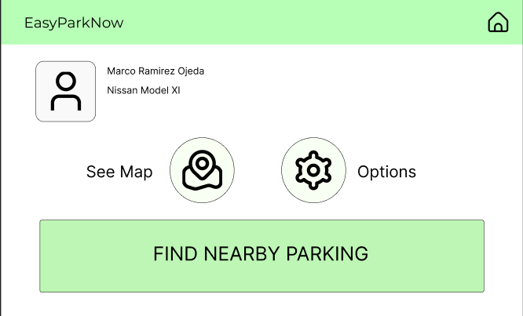

# Universidad Peruana de Ciencias Aplicadas
## Curso: Aplicaciones OpenSource
## Sección: SW55
## TB1 - EasyParkNow
### Integrantes:
* Conde Isla, Camila - u202114309
* Moreno Carmona, Oscar - u201911522
* Lastra Trinidad, Georgina - u201822503
* Onofre Ruiz, Carlos - u202115590
* Ortiz Fajardo. Tomas - u201910146

| Criterio Específico | Acciones Realizadas | Conclusiones |
|:-----:|:------:| :-------: |
| Comunica oralmente sus ideas y/o resultados con objetividad a público de diferentes especialidades y niveles jerárquicos, en el marco del desarrollo de un proyecto en ingeniería. | Onofre Ruiz Carlos Jesus TB1: Realizar las entrevistas me ayudo a saber como puedo llegar a mi publico objetivo comunicando lo que queremos lograr con este proyecto. | TB1: En conclusión, para esta primera entrega del proyecto desarrollar las entrevistas hacia nuestro segmento objetivo nos ha permitido aumentar nuestras habilidades Comunicativas y reconocer realmente que es lo que busca el usuario de nuestra app. Además, estas entrevistas nos han mostrado que existe una opinión bien similar entre todos respecto al tráfico de Lima. |
| Comunica en forma escrita ideas y/o resultados con objetividad a público de diferentes especialidades y niveles jerárquicos, en el marco del desarrollo de un proyecto en ingeniería. | Onofre Ruiz Carlos Jesus TB1: Realizar los wireframes y mock ups me permitio hacer realidad lo que queria mi publico haciendo pruebas dependiendo a sus necesidades tomando en cuenta las user history y las entrevistas. | TB1: En conclusión sobre la primera parte de este proyecto, el desarrollo de artefactos proporciona y crea contexto para nuestro proyecto. Nos permiten comunicar de una manera más optimizada y técnica sobre lo que queremos lograr dentro de nuestras ideas. Cada artefacto nos permitió comunicar de manera diferente lo que querían los entrevistados y lo que queríamos lograr con el producto final. |

## **Capítulo I: Introducción**
### 1.1 StartUp Profile
#### 1.1.1 Descripción del StartUp
Somos “DevWorkers”, una empresa enfocada al desarrollo de tecnologías que solucionen problemáticas en el ámbito del transporte que están presentes en nuestra sociedad. “EasyParkNow”, nuestra propuesta, tiene como objetivo apoyar a los conductores a encontrar un espacio de estacionamiento libre de manera inmediata a través de su ubicación GPS y la publicación de reseñas dadas por el resto de los usuarios y, de esta manera, solucionar los problemas de congestionamiento vehicular que se generan a raíz de una falta de conocimiento sobre ellos. En principio, la aplicación será gratuita para el público en general, sin embargo, también habrá una cuenta premium que brindará a los usuarios la posibilidad de pagar desde la aplicación la reserva de un espacio libre. En primera instancia, nos enfocaremos en la zona de Lima ya que esta abarca una mayor concentración de conductores activos y zonas libres para estacionarse.
Nuestra misión es brindar información sobre la ubicación de los aparcamientos próximos al usuario en tiempo real de manera que facilitemos la búsqueda y alquiler de ellas. Nuestra visión es convertirnos en una empresa líder en el desarrollo de tecnologías que ayuden a resolver distintas problemáticas del transporte en el Perú y, eventualmente, en el mundo.

#### 1.1.2 Perfiles de integrantes del equipo

|Imagen|Integrante|
|-----:|:-----|
| |Nombre: Tomas Ortiz Fajardo / Código: U201910146 / Carrera: Ingeniería de Software Soy Tomas Ortiz Fajardo y me encuentro cursando la carrera de Ingeniería de Software. Siempre me ha gustado la programación, y tengo la suerte de poder aprender y dominar más de un lenguaje de programación, como por ejemplo Python, Javascript, C + +, entre otros. Espero poder colaborar a este trabajo lo suficiente para poder generar más buenos recuerdos y seguir aprendiendo.|
|||
| | Nombre: Oscar Sebastian Nicolas Moreno Carmona / Código: U201911522 / Carrera: Ingeniería de Software Me considero un chico comprometido con mejorar cada día y aportar mis conocimientos para poder brindar soluciones óptimas a los problemas que pueden haber en la actualidad, siempre teniendo en cuenta el impacto que tiene ambientalmente y también considerando los valores éticos con los cuales fui formado.|
| | |
||Nombre: Onofre Ruiz Carlos Jesus / Código: U202115590 / Carrera: Ingeniería de Software Mi nombre es Carlos Jesus Onofre, tengo 19 años, estudio la carrera de Ingeniería de Software. Me considero una persona que cuenta con capacidades como el liderazgo en situaciones importantes, además del compromiso que tengo con los trabajos que se me presentan, de la misma forma soy una persona creativa con ideas que suman al equipo, asimismo mi actitud positiva hace que el proyecto no se vuelva tedioso para los integrantes de mi grupo|
|||
| |Nombre: Georgina Lastra Trinidad / Código: U201822503 / Carrera: Ingeniería de Software Mi nombre es Georgina Lastra y estudio la carrera de Ingeniería de Software. Soy una persona perseverante, creativa y comprometida. Siempre dispuesta a aprender cosas nuevas. Con mis conocimientos puedo aportar positivamente en la elaboración de nuestro proyecto. Asimismo, compartir y escuchar ideas de mis compañeros de esta manera obtener un buen resultado.|
| | |
| | Nombre: Camila Conde Isla / Código: U202114309 / Carrera: Ingeniería de Software Soy estudiante de la carrera de Ingeniería de Software en la cual me encuentro cursando el quinto ciclo de la carrera. Mi motivación para seguir aprendiendo es llegar a crear y diseñar soluciones creativas y entender mejor la tecnología. Me considero una persona creativa, proactiva, tolerante, respetuosa y apasionada por lo que me gusta. Me comprometo a apoyar en el proceso para poder tener un proyecto final bien planteado para obtener una buena nota.|

### 1.2 Solution Profile
A partir de la descripción del startup, nosotros como equipo hemos pensado en el desarrollo de una aplicación móvil el cual indicará las zonas de estacionamiento con acceso público y privado, y en este último podrás acceder a reservas, costo y espacios disponibles en tiempo real y de igual manera tendrás la opción de comparar con otros similares cerca de tu ubicación. El nombre que le daremos será “EasyParkNow”.

#### 1.2.1 Antecedentes y problemática
**WHAT(QUÉ)**

**¿Cuál es el problema?**
Actualmente, el incremento de vehículos en las calles del país ha generado una significativa reducción de espacios públicos. En el día a día miles de conductores salen a las calles con el objetivo de hacer sus actividades diarias y es por ello que muchos espacios de estacionamientos públicos están ocupados o muchos conductores desconocen sus ubicaciones, ya que no hay mucha publicidad sobre estos.

**¿Cuál es la relación con la persona en cuestión?**
El conductor, al no encontrar un estacionamiento para aparcar decide estacionarse en alguna zona no autorizada, lo cual genera congestión vehicular y en muchos casos se llega a recibir una infracción o embargo. When (Cuándo)

**¿Cuándo sucede el problema?**
Cuando el conductor necesita estacionar su vehículo y no tiene un lugar donde hacerlo, tal vez conoce algún estacionamiento, pero puede estar ocupado y no quiere perder tiempo yendo hasta ahí, o incluso puede no conocer ninguno, entonces deja su automóvil en lugares prohibidos. Where (Dónde)

**¿Dónde está el cliente cuando usa el producto?**
Por lo general, se encontrarán en las calles de Lima realizando sus actividades cotidianas.

**¿Dónde surge el problema?**
El problema surge en distintos lugares de la capital, pues día a día las personas deben salir a ejercer sus obligaciones laborales, todo depende de donde necesite dejar su automóvil. Who (Quién)

**¿Quiénes están involucrados?**
Puede estar involucrado un conductor profesional, personas que manejen un vehículo activamente o que ocurra una situación donde la persona tenga que estacionar alguno. También lo estarán los dueños de los estacionamientos que hayan registrado su espacio en nuestra plataforma.

**¿A quién le sucederá el problema?**
Principalmente a los conductores activos, ya que ellos son los más propensos a verse envueltos en este problema con mayor frecuencia.

**¿Quién lo utilizará?**
Cualquier persona que maneje un vehículo y necesite un lugar para aparcarlo, así como también los dueños de los estacionamientos que quieran registrar su estacionamiento en la aplicación.

**WHY (POR QUÉ)**

**¿Cuál es la causa del problema?**
La causa del problema es circunstancial; sin embargo, de todo esto la parte común es la poca información que tenemos en donde estacionar nuestro vehículo.

**HOW (CÓMO)**

**¿Cómo se llevan a cabo los hechos?**
Cuando el usuario no conoce ningún estacionamiento cercano y lleva tiempo sin encontrar alguno o los que conoce se encuentran llenos.

**HOW MUCH (CUÁNTO)**

**¿Cuántas personas son afectadas por esta problemática?**
De todas las multas de tránsito existentes, una gran cantidad de estas son por estacionarse en lugares prohibidos, exactamente la problemática que buscamos vencer.

#### 1.2.2 Lean UX Process
#### 1.2.2.1 Lean UX Problem Statement

Nuestro servicio ofrece un canal entre los conductores y los dueños de estacionamientos, siendo los primeros quienes presentan dificultades para encontrar un espacio libre para aparcar su vehículo. A través de nuestra plataforma, los usuarios tendrán acceso a la ubicación de los estacionamientos cercanos a ellos con información adicional como mostrar los cupos libres, los precios, reseñas de otros conductores, etc.
Hemos observado una problemática que sufren los conductores: los autos que transitan por Lima se incrementan constantemente, lo cual genera que los espacios de aparcamientos libres sean más escasos y difíciles de encontrar. Sumado a esto, la desinformación de lugares de estacionamiento disponibles y la negligencia de algunos individuos provoca que sea más común ver vehículos aparcados en zonas prohibidas. Esto provoca que los propietarios de los vehículos sean multados o en el peor de los casos embargados.
¿Cómo podemos evitar que los conductores se estacionen en lugares prohibidos a causa del desconocimiento o saturación de los estacionamientos disponibles?

#### 1.2.2.2 Lean UX Assumptions

1. **Creo que mis usuarios necesitan…** información sobre zonas de aparcamiento donde pueden estacionar su auto, ya sea estacionamientos públicos o privados

2. **Estas necesidades se pueden resolver con…** una aplicación móvil, que cumpla el propósito de mostrar zonas de estacionamientos cercanas a su ubicación y los datos necesarios para reservarlos.

3. **Mis clientes iniciales son (o serán) ...** los dueños de estacionamientos que quieran registrarse al servicio y los conductores que tengan dificultad para encontrar un estacionamiento en Lima.

4. **El valor #1 que un cliente quiere de mi servicio es…**  la ubicación en tiempo real de los estacionamientos disponibles más próximos.

5. **El cliente también puede obtener estos beneficios adicionales…** como la reserva de un estacionamiento a través de nuestra plataforma de pago y descuentos en las reservas según el tiempo de uso del aplicativo.

6. **Voy a adquirir la mayoría de mis clientes a través de…** publicidad en las principales redes sociales y anuncios por canales de comunicación como la radio y televisión.

7. **Haremos dinero a través de…** la suscripción de una membresía mensual por uso a los dueños de estacionamientos y publicidad de nuestros auspiciadores.

8. **Mi competencia principal en el mercado será…** Google Maps, siendo este uno de los mejores recursos para buscar ubicaciones en tiempo real.

9. **Los venceremos debido a…** la ausencia de un registro total de estacionamientos y una plataforma de pago por alquiler de ellos.

10. **Mi mayor riesgo de producto es…** no encontrar dueños de estacionamientos que quieren registrarse a nuestra plataforma.

11. **Resolveremos esto** ofreciendo al usuario una prueba gratuita de nuestro aplicativo por tiempo limitado.

**¿Quién es el usuario?**
Nuestros usuarios son todas aquellas personas que manejan algún vehículo y necesitan un espacio libre para estacionarse. 

**¿Dónde encaja nuestro producto en su trabajo o vida?**
En los días que los usuarios necesiten movilizarse hacia algún lugar y desconocen dónde pueden dejar aparcado su vehículo de manera segura.

**¿Cómo y cuándo es usado nuestro producto?**
Es usado como un apoyo a los conductores para guiarlos hacia el estacionamiento más conveniente para ellos. Por otro lado, es usado cuando necesitan dejar estacionado su vehículo en algún espacio libre seguro y permitido.

**¿Qué problema tendría nuestro producto y cómo se pueden resolver?**
Podría ocurrir una incorrecta vinculación de nuestra plataforma con el GPS del usuario o un incorrecto funcionamiento en nuestro canal de pago. Ambos problemas se pueden resolver a través de mantenimiento constante a nuestra plataforma (actualizaciones).

**¿Qué características son importantes?**
Nuestra plataforma debe tener un alto nivel de seguridad ya que por medio de esta se pueden efectuar transacciones. Además, debe manejar la información en tiempo real para que los usuarios tengan la información actualizada, por ejemplo, cuántos espacios libres quedan en un estacionamiento específico. Por último, debe tener una gran capacidad de memoria para poder almacenar a todos los usuarios que se registren ya que las personas que manejan algún vehículo representan un gran porcentaje de la población.

**¿Cómo debe verse nuestro servicio y cómo debe comportarse?**
Nuestro servicio debe verse como un sistema de apoyo a los conductores a través de una interfaz moderna e intuitiva. Además, debe comportarse de manera fluida y práctica para que la experiencia del usuario sea la mejor

#### 1.2.2.3 Lean UX Hypothesis Statement
Según lo propuesto en el solution profile se plantearon las siguientes hipótesis:

* **Creemos que** el uso de nuestra app permitirá al conductor identificar los aparcamientos autorizados donde podrá estacionar su vehículo, esto ayudará a disminuir la cantidad de multas. 

*Sabremos que hemos tenido éxito,*

*Cuando veamos que* la cantidad de infracciones dadas por un mal estacionamiento hayan disminuido en un 50% del total de personas que hayan instalado nuestra app en sus dispositivos.

* **Creemos que** nuestra solución será exitosa en Lima y Lima metropolitana, posicionándose como la mejor solución en la búsqueda de aparcamientos en el Perú.

*Sabremos que hemos tenido éxito,*

*Cuando vemos* que la cantidad de veces que nuestra app fue descargada supere el 40% en Lima y Lima metropolitana.

* **Creemos que** la interfaz donde se puntúe el estacionamiento según la experiencia de cada usuario que haya usado el servicio pueda ayudar a otras personas que recurran a nuestra app por el mismo problema y deseen un servicio que satisfaga sus necesidades.

*Sabremos que hemos tenido éxito,*

*Cuando veamos* mediante encuestas que el 30% de los usuarios nuevos fueron influenciados por usuarios ya registrados en nuestra app.

#### 1.2.2.4 Lean UX Canvas

### 1.3 Segmentos Objetivos
El objetivo principal de nuestro proyecto es ayudar a los conductores a localizar una zona de aparcamiento para estacionar su vehículo. Basándose en ello hemos identificado dos segmentos objetivos:

Conductores: Personas residentes de la ciudad de Lima que cuenten con un vehículo de transporte y tengan la necesidad diaria de buscar un estacionamiento.

Dueños de estacionamiento: Personas residentes de Lima que son dueños y/o manejan su propio estacionamiento o cuentan con un espacio para aparcar. Y desean tener publicidad y clientes para su estacionamiento. Al mismo tiempo, lograr registrarse en nuestra plataforma, donde podrá colocar la información de su estacionamiento. De esta manera, los conductores podrán ubicarlos fácilmente.

## **Capítulo II: Requirements Elicitation & Analysis**
### 2.1 Competidores
#### 2.1.1 Análisis Competitivo

|     |Parkner | Waze | Google Maps |
|-----|--------|------|-------------|
|Precio| Gratis | Gratis | Gratis |
|Confiabilidad| La confiabilidad de esta aplicación se basa en poder realizar un pago seguro y solo por el tiempo consumido en un estacionamiento. | La confiabilidad de esta aplicación se basa en mostrar opciones de estacionamientos seguros para poder estacionar el vehículo. | La confiabilidad de este se basa en brindar el lugar más cercano al usuario mediante el buscador.
|Información |Permite a los usuarios registrar y poner en alquiler sus espacios libres, ya sea en casas, edificios residenciales, oficinas corporativas, playas privadas, etc. Cabe destacar que Parkner es una plataforma gratuita para todos los que estén interesados en alquilar su espacio disponible, teniendo cada uno la posibilidad de determinar su propio precio y tiempo de alquiler. |Se usa cuando queremos sortear el tráfico de la ciudad, pero también es muy útil al momento de buscar donde estacionar. Solo debes entrar a la sección categorías y activar la opción estacionamiento y listo, ¡recibirás varias alternativas de estacionamiento que estén cercanas a tu ubicación.|Es una herramienta de búsqueda de ubicaciones que permite geolocalizar un punto concreto. Encontrar lugares de interés más cercano. |
|Limitaciones| Ninguna | No brinda información sobre la experiencia del usuario en ese estacionamiento. No brinda la tarifa aproximada de lo que cuesta el estacionamiento. | No se conoce el precio de los estacionamientos.No brinda información sobre la disponibilidad de los estacionamientos.
| Características Diferenciales | Reservas antes de llegar a tu destino. Encuentras estacionamiento desde tu celular. Precio seguro y justo sólo por el tiempo consumido. Libertad para elegir los horarios y las cocheras. | Cuando ya estás por llegar a tu destino, Waze te muestra opciones de estacionamientos cerca. | Es una aplicación bastante conocida y el gran porcentaje de la población la tiene instalada en su celular.|

#### 2.1.2 Estratégias frente a competidores
La estrategia que usaremos para destacar de nuestros competidores en este caso Parkner, que vendría ser una competencia directa, sería que nos diferenciamos en que nuestra app contará la seguridad de tu vehículo, ya que sabemos que parkner permite a los usuarios colocar en alquiler sus espacios libres pero no sabemos ni tenemos la certeza si el lugar es seguro, a diferencia de EasyParkNow que contamos con dueños de estacionamientos que colocan la información y seguridad para que sus vehículos estén en buenas manos.
En cuanto a Waze es un aplicación para evitar congestionamiento vehicular, siendo enfocada más como una herramienta de navegación social de coches particulares, aunque también cuenta con búsqueda de estacionamiento, a diferencia de esto nuestra aplicación busca ser fácil de usar e intuitiva teniendo en cuenta que algunos conductores están conduciendo y recurren a buscar un lugar para estacionarse  en ese momento, además de conocer las tarifas de estacionamiento en la misma app como descripción adicional.
Por último, en Google Maps nos muestra los estacionamientos que se encuentran cerca de la zona, pero sabemos que no se encuentra actualizada y a veces esto puede ser una opción poco fiable si el usuario quiere buscar un estacionamiento, además de no saber si el lugar se encuentra disponible. En cambio, nuestra aplicación muestra los lugares más cercanos tomando en cuenta la disponibilidad en la hora actual, logrando además poder reservar un espacio dentro de la zona.

### 2.2 Entrevistas
#### 2.2.1 Diseño de entrevistas
**CONDUCTORES**

¿Nos podría brindar su nombre, edad, lugar de residencia, ocupación ?

¿Cuánto tiempo le tomó encontrar un estacionamiento? 

¿Qué hace cuando no encuentra un estacionamiento?

¿Piensa que la tarifa de estacionamiento suele ser adecuada?

¿Qué es lo que considera cuando elige un estacionamiento?
 
¿Qué opina de los estacionamientos privados?
 
¿Suele encontrar estacionamiento privado cerca de su lugar de destino?

¿En qué se basa para elegir entre un estacionamiento u otro?

¿Tendría la confianza suficiente para dejar su vehículo en una cochera alquilada? 

¿Qué beneficios cree que le brindaría una aplicación que le recomiende lugares de estacionamiento cerca? 

EL PRODUCTO:

¿Qué le parecería la aplicación como solución al problema de no encontrar estacionamiento? 

¿Qué opciones o funcionalidades le gustaría incluir?
¿Usted recomendaría la aplicación a sus conocidos?

**DUEÑOS**

¿Nos podría brindar su nombre, edad, lugar de residencia, ocupación ?

¿Qué información o dato es importante para usted cuando recibe a un cliente(conductor)?

 ¿Cuál es la tarifa que dispone usted al público por sus servicios?
¿Por qué cree que es bueno conseguir un estacionamiento fijo?

¿Cuál es el tiempo promedio que ocupan los usuarios dentro del estacionamiento? ¿Por qué cree usted que sus usuarios se ocupan de este tiempo? 

¿Qué es lo que su local ofrece o se distingue de otros locales de estacionamientos cercanos?
 
¿Considera que el lugar donde está ubicado su estacionamiento le ayuda a recibir más clientes?

¿Ha tenido problemas con los tiempos de reserva de algunos clientes? ¿Cree que es mejor reservar con anticipación?

¿Cree que le conviene aceptar todo tipo de vehículos o podría haber restricciones? 

EL PRODUCTO:

¿Qué le parece la aplicación? ¿Crees que realmente le ayude a difundir más su estacionamiento?

¿Tiene alguna sugerencia con respecto a la aplicación brindada?

#### 2.2.2 Registro de entrevistas

Link de las Entrevistas: https://youtu.be/TkNagEN1cBE

|Conductor|         |
|---------|---------|
|Nombres y Apellidos| Reyner Chuquinaupa|
|Edad| 53|
|Distrito | San Miguel |
|En la entrevista Reyner nos comenta su experiencia del problema de no conseguir estacionamiento de forma rápida y fácil. Nos cuenta que desde su punto de vista hay variedad en precios de estacionamientos pero los más conocidos son los más caros. Casi siempre encuentra estacionamientos lejos de su destino porque desconoce el funcionamiento de uno cerca. Para él es muy importante el acceso y el precio al momento de elegir un estacionamiento. Considera que la aplicación es útil por indicar el precio y  anticipar un estacionamiento antes de llegar al destino. | |

|Dueño|         |
|---------|---------|
|Nombres y Apellidos| Ericka Isla Ruiz|
|Edad| 48|
|Distrito | San Miguel |
|La señora Ericka nos comenta que lo más importante antes de vender o alquilar es la identificación del conductor y la placa del vehículo para evitar problemas. Considera que la tarifa debe ser más económica que los grandes estacionamientos incluyendo una tarifa por minutos, algo que no se considera en las empresas grandes. Dice que es importante poder incluir una función de reserva, publicar promociones por uso de estacionamiento | |

|Conductor|         |
|---------|---------|
|Nombres y Apellidos| Stewart Tapia Nieto|
|Edad| 26|
|Distrito | Los Olivos |
|En la entrevista, el joven Stewart nos cuenta que el encontrar un estacionamiento cerca a su trabajo se ha vuelto un problema cotidiano. Debido a que le toma de 30 a 40 min encontrar uno. Él considera que la tarifa de algunos estacionamientos son elevados por la demanda del lugar. Para él lo primordial al momento de elegir un estacionamiento es la seguridad y que este cuente con un espacio lo suficientemente amplio para estacionar su vehículo. Finalmente, nos dice que para él sería importante que se mostraran las tarifas de los estacionamientos dentro de la aplicación. Asimismo, se muestren imágenes y valoraciones  del estacionamiento. | |

|Conductor|         |
|---------|---------|
|Nombres y Apellidos| Luis Kano Soto|
|Edad| 41|
|Distrito | Los Olivos |
|En la entrevista, el señor Luis indica que le toma de 15 a 20 min encontrar un estacionamiento normalmente o hasta más depende al lugar al que vaya. Algunas veces cuando no encuentra un estacionamiento pronto, se ve obligado a seguir buscando por miedo a las multas y a la seguridad de su vehículo. También nos dice que considera que las tarifas no son las adecuadas, ya que muchos de los estacionamientos cobran por horas. Él menciona que el factor a tomar en cuenta al momento de escoger un estacionamiento es que este se encuentre cerca a su lugar de destino, lo otro es que cuente con una tarifa no tan alta y por último la seguridad, debido a que al ser un estacionamiento privado, este cuente con cámaras de seguridad. Finalmente, él menciona dos funciones que le ayudarían bastante a encontrar un estacionamiento ideal y son que muestre la ubicación exacta y que muestre la tarifa del estacionamiento. | |

|Dueño|         |
|---------|---------|
|Nombres y Apellidos| Edgar Ruiz Condor|
|Edad| 55|
|Distrito | Lima |
|En la entrevista el señor Edgar nos brinda información de cómo administrar y llegar a su público en su estacionamiento de vehículos, su público prefiere sus servicios ya que se encuentra en el centro de lima cerca a los lugares concurridos. Le presentamos nuestra propuesta y nos dijo que sería una buena idea de esa manera podrá mostrar los beneficios y detalles como la seguridad que tiene su playa de estacionamiento, una de sus recomendaciones fue de que sea una aplicación sencilla y fácil de usar ya que él no tenía mucha experiencia con el uso de la tecnología. | |

|Conductor |         |
|---------|---------|
|Nombres y Apellidos| Jaen Paul Onofre|
|Edad| 26|
|Distrito | Lima |
|En la entrevista el señor Jaen Paul, que vendría ser un conductor diario ya que el trabaja y le queda a 1 hora de su hogar y en su empresa que trabaja no tienen un estacionamiento por ello el tiene que lidiar dia a dia para poder buscar un estacionamiento confiable que esté disponible 24/7. Le presentamos nuestra propuesta y nos dijo que sería muy útil ya que él es una persona ocupada y a veces suele buscar un estacionamiento a última hora, eso es lo que desea el de nuestro programa que sea sencilla y rápida para poder buscar un estacionamiento. Una cosa que nos dijo que podríamos mejorar sería que podríamos mejorar sería poder reservar espacios en los estacionamientos seleccionados para que cuando llegue no esté ocupado. | |
### 2.2.3 Analisis de Entrevistas

## 2.3 NeedFinding

### 2.3.1 User Personas
En esta parte crearemos los user persona para cada uno de los segmentos objetivos de nuestra Startup haciendo uso de las entrevistas que logramos recolectar, mostrando sus objetivos, motivaciones, frustraciones, entre otras cosas.

User Persona: Conductor

User Persona: Dueño

### 2.3.2 User task Matrix
A continuación, se está presentando el User Task Matrix con nuestros 3 segmentos objetivos, conductor, dueño de estacionamiento y arrendador privado, donde se determinará la frecuencia e importancia de las tareas que realiza cada uno en su vida normal y comparando entre segmentos.

### 2.3.5 As-Is Scenario Mapping

Segmento 1: Conductor

Segmento 2: Dueño de estacionamiento

## Capítulo III: Requirements Specification

### 3.1. To-Be Scenario Mapping.

### 3.2. User Stories

|Epic/User Story|Título|Descripción|Criterio de aceptación|Relacionado (EPIC ID)|
|-|-|-|-|-|
|US01|Realizar una reserva de un estacionamiento cercano|Como usuario deseo poder realizar la reserva de un espacio de estacionamiento lo más cercano posible a mi ubicación|DADO que el usuario se encuentra en la página principal, CUANDO ingrese a la opción de reservar un estacionamiento ENTONCES me muestre una lista de opciones disponibles con los horarios correspondientes|US02|
|US02|Realizar la reserva de una estacionamiento específico|Como usuario deseo realizar una reserva de un estacionamiento que yo quiero en una ubicación, fecha y hora específica|DADO que el usuario se encuentra en la página principal, CUANDO ingrese a la opción de reserva, me muestre el estacionamiento que busco ENTONCES me permite hacer la reserva a la fecha y hora que quiero|US01|
|US03|Registrar la cuenta de usuario|Como usuario deseo poder registrarme en la plataforma para poder aprovechar el servicio brindado|<li>DADO que el usuario se encuentre en la landing page CUANDO ingrese a la opción de registrarse ENTONCES me aparezca un formulario para poder registrar mi cuenta como conductor<li>DADO que el usuario se encuentra en la landing page CUANDO el usuario haga click en la opción de registrarse ENTONCES aparezca un formulario para registrarse como dueño de un estacionamiento|US04|
|US04|Iniciar sesión|Como usuario deseo poder iniciar sesión ya estando registrado en la plataforma|<li>DADO que el usuario ya tiene su cuenta registrada CUANDO ingrese su correo electrónico y contraseña incorrectos ENTONCES aparezca un aviso de datos incorrectos<li>DADO que el usuario ya tiene su cuenta registrada CUANDO ingrese su correo electrónico y contraseña correctos ENTONCES se le permita el ingreso a la plataforma.|US03|
|US05|Editar los datos del perfil de usuario|Como usuario deseo poder modificar mis datos personales de mi perfil dentro de la aplicación|DADO que el usuario se encuentra en su perfil CUANDO aprete en la opción de “Editar perfil” ENTONCES la aplicación le permite editar los datos personales correspondientes|US03|
|US06|Visualización de la calificación de un estacionamiento|Como usuario deseo poder ver la calificación que tiene un estacionamiento|DADO que el usuario se encuentra en el inicio CUANDO busque un estacionamiento específico ENTONCES le muestre la calificación que tiene este local|-|
|US07|Establecer detalles de estacionamiento|Como dueño del lugar de estacionamiento deseo poder establecer la información de mi local para que los clientes tengan en cuenta|DADO que soy dueño de estacionamiento y estoy registrado CUANDO use la opción de “Publicar estacionamiento” ENTONCES se muestre un formulario para poder completar la información de mi estacionamiento y publicarlo|-|
|US08|Visualizar comentarios sobre el estacionamiento (dueño)|Como dueño de estacionamiento deseo poder ver mis publicaciones y los comentarios correspondientes|DADO que soy dueño y he publicado mis estacionamientos CUANDO aprete en “Ver mis publicaciones” ENTONCES se muestre mis estacionamientos, las calificaciones y comentarios|-|
|US09|Ver comentarios sobre el estacionamiento (conductor)|Como usuario deseo poder ver los comentarios correspondientes de un estacionamiento|DADO que soy un conductor CUANDO busque un estacionamiento específico ENTONCES se muestre los comentarios realizados por otros clientes.|-|
|US10|Cargar datos de mi vehículo|Como usuario de la aplicación deseo poder ingresar los datos de mi vehículo para que se registren en la plataforma|DADO que el usuario quiere subir los datos de su vehículo CUANDO ingrese a su perfil y haga click en la opción “Mis vehículos” ENTONCES se muestre un formulario para poner los datos de su vehículo|-|
|US11|Ingresar datos de pago|Como usuario deseo poder agregar los datos de pago para poder realizar reservas|DADO que el usuario ya tiene su cuenta registrando CUANDO entre a “Mi perfil” y aprete en la opción de “Registrar metodo de pago” ENTONCES se mostrará un formulario para llenar los datos de la tarjeta de credito|-|
|US12|Reprogramar la cita|Como usuario deseo poder reprogramar una reservación si es que tengo algún percance.|DADO que el usuario ya ha registrado una reserva CUANDO vaya a la opción “Mis reservas” y tenga una reserva hecha y use la opcion|-|
|US13|Multi-idiomas|Como usuario deseo poder cambiar el idioma de la página web al lenguaje que yo entienda|DADO que el usuario se encuentra en cualquier parte de la aplicación web CUANDO aprete en el boton “Idioma” ENTONCES se traducirá al lenguaje deseado|-|
|US14|Recibir comprobante de pago electrónico|Como usuario deseo recibir un comprobante de pago en el cual se especifiquen los datos correspondientes|DADO que el usuario ya concluyó su servicio de estacionamiento CUANDO vuelva a la página de inicio ENTONCES la aplicación le enviará un comprobante a su correo|-|
|US15|Cancelar cita|Como usuario deseo cancelar la reserva que realicé|DADO que el usuario se encuentra en la sección “Mis reservas” CUANDO aprete en la opción “Cancelar reserva” ENTONCES se cancelará la reserva y se cobrará una penalización según el tiempo que estuvo reservado el estacionamiento|-|

### 3.3 Impact Mapping

Segmento 1: Conductor

Segmento 2: Dueño de estacionamiento

### 3.4. Product Backlog

## **Capítulo IV: Product Design**
### 4.1 Style Guidelines
#### 4.1.1 General Style Guidelines
A continuación, se muestra la paleta de colores, iconos y tipografía que usamos para estandarizar los estilos de la aplicación web.
El color escogido es el #D6FFB6, que es un color variado del verde. Se busca dar seguridad, confianza y por ser un color “productivo”. Luego tenemos al color negro #FFFFFF por ser prestigioso y clásico.

La fuente primaria es “Montserrat”. Esta fue elegida para el texto, título y demás componentes que se utilizarán en el Landing Page. Su creadora es Julieta Ulanovsky. 

Las fuentes que se utilizarán para el título y subtítulos de la aplicación es Inter, quien su autor es Rasmus Andersson.

#### 4.1.1 Web Style Guidelines
Escogimos el color #D6FFB6 una variedad del color verde para dar una identidad de confianza, seguridad y crecimiento, luego optamos por el color #FBF4BB para comunicar tranquilidad. Por último, el color negro #FFFFFF para crear contraste y pureza.

La fuente “Montserrat” es la elegida para el texto, título y demás componentes que se utilizarán en el Landing Page. La diseñadora Julieta Ulanovsky es la persona que creó esta fuente, con el objetivo de rescatar la belleza urbana. Además, nos encaminamos en plasmar la
identidad de la educación con esta fuente.

### 4.2. Information Architecture.
Esta sección se basa principalmente en la organización del contenido de la aplicación web y landing page de Mecanillama. A continuación, podemos ver los tópicos de Organization Systems, Labeling Systems, Searching Systems y Navigation Systems tomados en cuenta para la evaluación de la distribución del contenido.

#### 4.2.1. Organization Systems.
Para los sistemas de organización decidimos tomar en cuenta el contenido de Asimov, que cuenta con una forma jerárquica, encima de una organización secuencial, visual y matricial, además de los esquemas de organización alfabéticos, por tópicos, entre otros, según los usuarios.
* **Organización visual**
Esta cuenta con la forma jerárquica, que nos permite poderla implementar en la pantalla de inicio del usuario que desea alquilar, dándole gran importancia a las secciones de “Rentar un estacionamiento” y “Ver datos del estacionamiento” son de mayor importancia y por ende tiene una mayor jerarquía, siendo todo lo contrario para la sección de “Ver Historial de reservas”. Debido a este tipo de organización, se les da mayor importancia a las secciones más utilizadas por los usuarios.
Otro ejemplo, cuando se despliega los datos de la persona que pone su estacionamiento en alquiler, se le va a dar mayor jerarquía a datos como “Reseñas” y “Precio del estacionamiento” debido al gran interés que tendrían los arrendadores cuando busquen un estacionamiento para usar. Por otro lado, datos como nombre de la persona y foto de la persona no se encontraría tan algo en la jerarquía organizacional.
* **Organización secuencial**
En el caso de secuencial se le añade el uso de campos para poder editar datos del usuario, para-Asimov ya que estos en el caso de la aplicación serán utilizados en la modificación de información personal del dueño y la creación de un nuevo estacionamiento para alquilar. Organización matricial
Para la organización matricial se trata de incluir las listas de los estacionamientos más cercanos del usuario para que pueda elegir, así como mostrarle al usuario su historial de alquileres de estacionamiento.

#### 4.2.2. Labeling Systems.
El sistema de etiquetado en nuestra aplicación utilizará un lenguaje sencillo y sencillo con el fin de que los usuarios puedan identificar rápidamente lo que desean hacer sin problema alguno.

Barra de navegación:

|Etiqueta |Descripción de la etiqueta |
|---------|---------------------------|
|Todos los segmentos                  |
|Inicio| Sección que muestra contenido personalizado a cada tipo de usuario y es la primera vista que se obtiene una vez se autentique el usuario en la aplicación web. |
|Mi perfil| Sección con los datos personales del usuario, incluye todo lo relacionado a la información del usuario.|
|Dueños de estacionamientos y arrendadores |
|Mis espacios|Sección que muestra los espacios del estacionamiento en cuestión. |
|Precios| Sección que muestra los precios por tamaño del vehículo a ingresar al local.|

#### 4.2.3. SEO Tags and Meta Tags
Los Meta Tags son básicamente proveedores de información para el navegador que se encuentran en los archivos HTML de la página. A esta información se le llama “Metadata” y aunque no puede ser vista por el usuario, esta es de mucha ayuda para los motores de búsqueda y navegadores. Algunos de los más importantes y que consideramos son importantes para nuestro proyecto son, listadas de mas importante a menos importante:

|Meta Data ID |Explicación |Ejemplo |
|-------------|------------|--------|
|Meta Content Type| Este tag es muy útil cuando quieres declarar los caracteres de tu página. De no usarlo puede tener un impacto negativo en el navegador. |<meta httpequiv="ContentType" content="text/html;charset=utf-8" />|
|Title| El título es muy importante como título de por sí, pero además la información que le brinda al motor de búsqueda. Debera haber un tag de título diferente por página.|  |
|Meta Description| Este meta sirve para que los usuarios puedan encontrar la página mucho más rápido en el navegador, ya que será lo que les llame la atención para entrar a la página o no.|  |
|Viewport| Para los usuarios que vayan a utilizar un móvil para abrir nuestra página, este tag es para mejorar su experiencia en su teléfono. |  |
|Geo| Como dice en el nombre, es un tag de geolocalización. Este se divide en 3 secciones: Nombre del lugar, posición y región. |  |
|Social Media Tags| Muy simple. Para que puedas compartir información en plataformas como por ejemplo Twitter. Creemos que tiene cierta relevancia en el trabajo pero no tanta.|  |
|Site Verification| Este tag no es estrictamente necesario, ya que motores de búsqueda como Google o Yahoo! tienen otras maneras de mantener verificado tu sitio, sea a través de DNS, cuenta de Google
Analytics, entre otros. Pero a veces alguna de estas opciones falla y es mejor tener un plan B.|  |

#### 4.2.4. Searching Systems.
Para esta sección, en la plataforma hemos decidido implementar dos tipos de sistemas de búsquedas (barra de búsqueda y filtros) en la pantalla de la aplicación.
En primer lugar, tenemos el inicio de nuestro sitio web en la cual mostramos su organización jerárquica con anterioridad. Como esta pantalla principal abarca gran cantidad de información tendrá un
filtro que la dividirá en tres secciones:
* Más recomendados
* Disponibles ahora
* Cerca de ti 

En segundo lugar, se aplicará un sistema de búsqueda por texto para acceder a servicios que le interese al usuario. Asimismo, filtros para separar la información encontrada por el texto ingresado.
Estos filtros serán divididos de la siguiente manera:
* Rango de precios de los estacionamientos
* Tipo de estacionamientos
* Características con las que cuenta el taller mecánico Finalmente, se implementarán filtros en el perfil de los talleres para separar sus características y servicios.
* Lavado de carro
* Servicio de Valet parking
* Venta de snacks

#### 4.2.5. Navigation Systems.
Para asegurar la mejor experiencia al usuario se planteó una jerarquía de la información clara y coherente. Es así como se plantea que el usuario tenga un esquema claro de la organización del sitio.
En esta sección se considera una navegación estática que oriente al usuario en el sitio. Al ser estática el usuario siempre podrá retroceder teniendo en cuenta la navegación.

## 4.3 Landing Page UI Design

### 4.3.1 Landing Page Wireframe

Header: Acá se puede apreciar el header de la página, en donde hemos decidido usar un estilo bien simple y fácil de entender. Del lado derecho están los botones Log In y Sign Up, al medio los principales botones de la página como el About Us y los Plans, y por último en el extremo izquierdo nuestro logo.

Presentation: Acá se puede apreciar la presentation de la página. Toda la información de la página presentation se mostrará al medio, siendo el resto del espacio usado para mostrar datos o imágenes relevantes para la página.

EasyParkNow: Acá se puede apreciar el encabezado “EasyParkNow” de la página. Mismo concepto que la página presentation, mostrar el texto centrado en la página, y el resto de datos e imágenes en lo que sobra de la página. 

TestEasyParkNow: Acá se puede apreciar la sección de TestEasyParkNow de la página. Este sería el motor de reserva para que el usuario pueda reservar los estacionamientos que desee, una vez filtrada la búsqueda.

Plans: Acá se puede apreciar los 2 planes en forma de carta de EasyParkNow. Acá se mostrará los dos tipos de planes que ofrecemos, junto con los beneficios que traería cada una, y el costo de estos. 

AboutUs: Acá se puede apreciar nuestra presentación como integrantes del equipo de la página, cada uno mostrando nuestra foto, el nombre de cada uno junto con la carrera que han elegido estudiar.

Footer: Acá se puede ver el footer de la página, con otros botones como por ejemplo el About Us, los Plans, Presentation, y otros datos relevantes para la página. 

Link del wireframe:  https://www.figma.com/file/7iessZFgDK0qTkNEKUAi6n/Urban-Solution?type=design&node-id=0-1&mode=design&t=Nri1wYDLsdmHKZIv-0

### 4.3.2 Landing Page Mock Up

Header: Acá se puede apreciar el header de la página, en donde hemos decidido usar un estilo bien simple y fácil de entender. Del lado derecho están los botones Log In y Sign Up, al medio los principales botones de la página como el About Us y los Plans, y por último en el extremo izquierdo nuestro logo.

Presentation: Acá se puede apreciar la presentation de la página. Toda la información de la página presentation se mostrará al medio, siendo el resto del espacio usado para mostrar datos o imágenes relevantes para la página.

EasyParkNow: Acá se puede apreciar el encabezado “EasyParkNow” de la página. Mismo concepto que la página presentation, mostrar el texto centrado en la página, y el resto de datos e imágenes en lo que sobra de la página.

TestEasyParkNow: Acá se puede apreciar la sección de TestEasyParkNow de la página. Este sería el motor de reserva para que el usuario pueda reservar los estacionamientos que desee, ya sea por distintos metodos de pago buscando previo a su salida.

Plans: Acá se puede apreciar los 2 planes en forma de carta de Freeplace. Acá se mostrará los dos tipos de planes que ofrecemos, junto con los beneficios que traería cada una, y el costo de estos. 

AboutUs: Acá se puede apreciar nuestra presentación como integrantes del equipo de la página, cada uno mostrando nuestra foto, el nombre de cada uno junto con la carrera que han elegido estudiar.

Footer: Acá se puede ver el footer de la página.

Link MockUps:
https://www.figma.com/file/yn2i6VlaRkAre4xpe1l3lw/Lading-page-Mock-Up?type=design&node-id=0-1&mode=design&t=QHjDmKEgct7u7P9A-0

## 4.4 Web Applications UX/UI Design

### 4.4.1 Web Applications Wireframes

Link del Figma: https://www.figma.com/file/7iessZFgDK0qTkNEKUAi6n/Urban-Solution?type=design&node-id=40-2&mode=design&t=g0cqC2Mprtxp6ViH-0

Vamos a poder apreciar en orden las vistas que temenos para nuestra aplicacion web en formato Wireframes, primero la vista principal, luego el Log-In de nuestra aplicacion, la seccion de perfil, despues la vista de home y finalmente la vista de reservacion.

### 4.4.2 Web Applications Wireflow Diagrams

Link del Diagrama: https://lucid.app/lucidchart/bee9dab3-8ad7-4052-b2a5-45103aceb477/edit?viewport_loc=-10917%2C-39%2C16950%2C7385%2C0_0&invitationId=inv_a33e1efa-8ac6-4484-953a-0ee3016a92aa

El usuario desea guardar su vehiculo, por ello decide reservar un estacionamiento de 3 estrellas por dos horas.

El usuario desea ingresar a la aplicacion y ver el mapa donde se encuentran los estacionamientos.

### 4.4.3 Web Applications Mockups

Link del Figma: https://www.figma.com/file/yn2i6VlaRkAre4xpe1l3lw/Lading-page-Mock-Up?type=design&node-id=89-2&mode=design&t=rJCC8AUzN5S9zP3q-0

Vamos a poder apreciar en orden las vistas que temenos para nuestra aplicacion web en formato prototipo, primero la vista del Log-In de nuestra aplicacion, la seccion de home, despues la vista de reservacion, la vista de registro y finalmente la vista de editar perfil.

### 4.4.4 Web Applications User Flow Diagrams

### 4.5 Web Applications Prototyping

Link del Prototipo:
https://www.figma.com/proto/yn2i6VlaRkAre4xpe1l3lw/Lading-page-Mock-Up?type=design&node-id=115-3&t=T2m2NcerhmpALgep-1&scaling=scale-down&page-id=115%3A2&starting-point-node-id=115%3A3&mode=design

### 4.6. Domain-Driven Software Architecture.

#### 4.6.1. Software Architecture Context Diagram.

#### 4.6.2. Software Architecture Container Diagrams.

#### 4.6.3. Software Architecture Components Diagrams.

### 4.7. Software Object-Oriented Design.

#### 4.7.1. Class Diagrams.

#### 4.7.2. Class Dictionary.

### 4.8. Database Design.

#### 4.8.1. Database Diagram

## Capítulo V: Product Implementation, Validation & Deployment.

### 5.1. Software Configuration Management.

#### 5.1.1. Software Development Environment Configuration.

#### 5.1.2. Source Code Management.

#### 5.1.3. Source Code Style Guide & Conventions.

#### 5.1.4. Software Deployment Configuration.

### 5.2. Landing Page, Services & Applications Implementation.

#### 5.2.1. Sprint 1

##### 5.2.1.1. Sprint Planning 1.

##### 5.2.1.2. Sprint Backlog 1.

##### 5.2.1.3. Development Evidence for Sprint Review.

##### 5.2.1.4. Testing Suite Evidence for Sprint Review.

##### 5.2.1.5. Execution Evidence for Sprint Review.

##### 5.2.1.6. Services Documentation Evidence for Sprint Review.

##### 5.2.1.7. Software Deployment Evidence for Sprint Review.

##### 5.2.1.8. Team Collaboration Insights during Sprint.

## Conclusiones

El proyecto se creo con la intencion de ayudar a los usuarios que quieran encontrar un lugar de aparcamiento de forma rápida y cómoda mediante un teléfono móvil y reservala con un clic en la pantalla. Pensamos que era una idea muy interesante para implementar y aprender sobre las habilidades requeridas, los desafíos que implica implementar la aplicación, etc. A lo largo del proyecto, nuestras ideas se fueron afinando y la planificación se realizó teniendo en cuenta los desafíos que enfrentamos y las tareas que teníamos que resolver. 

Descubrimos que agregar una sección al frente de la aplicación web para indicar cuántos espacios de estacionamiento hay disponibles era una idea que valía la pena seguir, ya que anima a los clientes a interactuar con la aplicación para descubrir de qué se trata.

Además, creemos que mientras desarrollamos este proyecto, nos será de gran ayuda comprender cómo usar GitHub, sin mencionar el conocimiento de IDE, tecnologías de programación, colaboración en equipo y cómo construir un proyecto desde 0 hasta ahora. Hoy es el día. 

## Anexos

Link del wireframe:  https://www.figma.com/file/7iessZFgDK0qTkNEKUAi6n/Urban-Solution?type=design&node-id=0-1&mode=design&t=Nri1wYDLsdmHKZIv-0

Link del Prototipo:
https://www.figma.com/proto/yn2i6VlaRkAre4xpe1l3lw/Lading-page-Mock-Up?type=design&node-id=115-3&t=T2m2NcerhmpALgep-1&scaling=scale-down&page-id=115%3A2&starting-point-node-id=115%3A3&mode=design

Link del Figma: https://www.figma.com/file/7iessZFgDK0qTkNEKUAi6n/Urban-Solution?type=design&node-id=40-2&mode=design&t=g0cqC2Mprtxp6ViH-0

Link del Diagrama: https://lucid.app/lucidchart/bee9dab3-8ad7-4052-b2a5-45103aceb477/edit?viewport_loc=-10917%2C-39%2C16950%2C7385%2C0_0&invitationId=inv_a33e1efa-8ac6-4484-953a-0ee3016a92aa

Link del Figma: https://www.figma.com/file/yn2i6VlaRkAre4xpe1l3lw/Lading-page-Mock-Up?type=design&node-id=89-2&mode=design&t=rJCC8AUzN5S9zP3q-0

Link de las Entrevistas: https://youtu.be/TkNagEN1cBE

Link MockUps:
https://www.figma.com/file/yn2i6VlaRkAre4xpe1l3lw/Lading-page-Mock-Up?type=design&node-id=0-1&mode=design&t=QHjDmKEgct7u7P9A-0